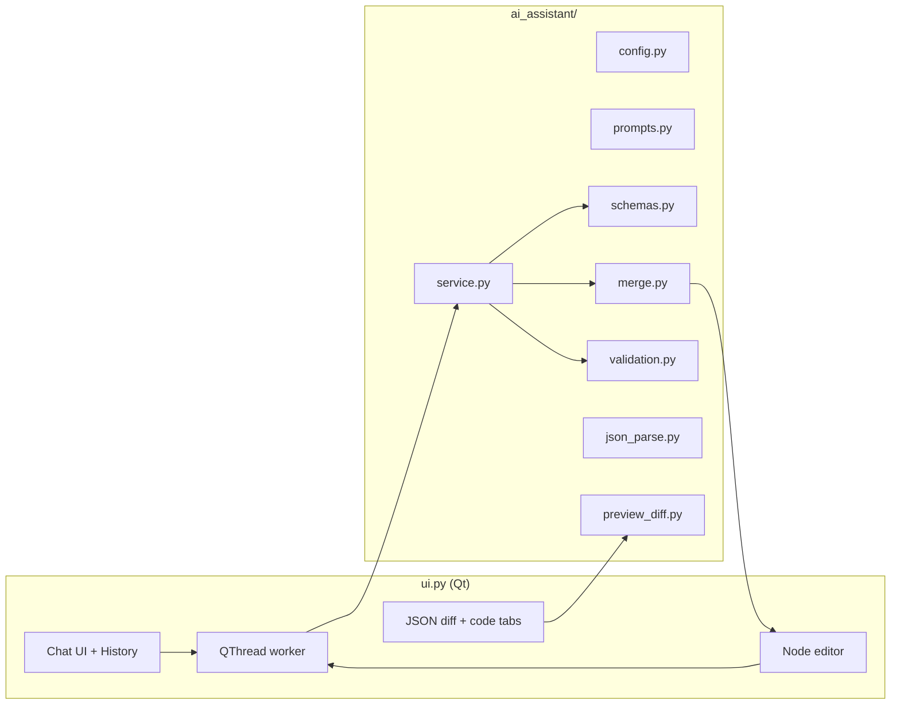

# AI Assistant Module — Architecture & Handoff Guide

This document summarizes how the Ryven **Node Generator** embeds the AI assistant, how **memory and context** work, and which files matter. Use it to onboard another AI or developer without re-reading the full chat history.

**Primary UI entry:** `Generator/ui.py` (`GeneratorDesignerUI`).  
**AI logic package:** `Generator/ai_assistant/`.  
**Project persistence:** `Generator/project_workspace.py`.

---

## 1. Goals & Product Rules

- **Assistant output (user-visible):** `message` in **Simplified Chinese** (chat + streaming text before structured JSON).
- **`core_logic`:** Python for the node’s `try` body — **English** identifiers/comments; validated before apply.
- **`config_patch`:** Optional partial node dict; merged via a **whitelist** (`merge.py`). Unknown keys are skipped with reasons.
- **Single apply path:** Model returns `AssistantTurn` → UI shows **preview** → user **Keep** (commit) or **Undo** (discard). No silent overwrite of `nodes_data`.
- **Prioritize behavior:** Prompts and schema treat **`core_logic`** as highest priority when the user asks for logic changes.

---

## 2. High-Level Architecture

- **UI** owns `nodes_data`, `current_idx`, chat transcript widgets, **Keep/Undo** state, and project autosave.
- **`ai_assistant`** is **stateless** per request: it receives text + history + JSON context and returns one structured dict (plus streaming callbacks when enabled).

---

## 3. How the AI Module Is Embedded (`ui.py`)

| Mechanism | Role |
|-----------|------|
| **`_AITurnWorker` (`QThread`)** | Calls `run_assistant_turn` / `run_turn_respecting_stream_flag` off the GUI thread. Emits `finished_ok(dict)` or `failed(str)`. |
| **`_ai_history`** | List of `("user" \| "assistant" \| "system", str)`. Persisted to disk as part of the project. |
| **`_ai_on_send`** | Appends user turn to `_ai_history`, sets `_ai_turn_in_progress`, passes **`history[:-1]`** + **current `user_text`** into the worker (same contract as `service.py`: past pairs + latest user message as last HumanMessage). |
| **`_ai_on_worker_ok`** | Appends assistant message, stores **`_ai_last_result`**, runs **`_ai_try_present_preview`**, rebuilds chat UI. |
| **Preview state** | `_ai_preview_active`, `_ai_pending_snapshot_nodes`, `_ai_pending_proposed_nodes`, field tinting, JSON tab HTML diff. |
| **Keep / Undo** | **Keep:** `_ai_preview_active` cleared, `nodes_data` ← proposed copy, `save_current_state()`. **Undo:** restore snapshot, clear `_ai_last_result`, refresh previews. |
| **Withdraw (↩)** | Per user bubble: removes that user + following assistant/system turn from `_ai_history`; if it was the **latest** turn and a preview exists, behaves like Undo for config. |

**Important:** `QThread.finished` may run after `finished_ok`; commit buttons use **`not worker.isRunning()`** (not only `worker is None`) so **Keep/Undo** enable correctly.

---

## 4. Memory & “Context” Strategy

### 4.1 What is **not** sent

- The full `generator.py` / old `gui.py` sources are **not** injected into every request.
- The model does **not** receive the entire multi-node project as a free-form file dump unless reflected in structured JSON below.

### 4.2 What **is** sent each turn (`service.py`)

1. **System prompt** (`prompts.py`) + streaming suffix when streaming.
2. **Second system message:** “Current node JSON” = JSON encoding of  
   `{ "node": <deep copy of current node>, "existing_class_names": [...] }`  
   so the model knows ports, labels, and naming collisions.
3. **Chat history** as alternating `HumanMessage` / `AIMessage` from `_ai_history` **excluding** the message currently being sent (that text is appended as the final `HumanMessage`).

### 4.3 What is **remembered** across turns

| Store | Content |
|-------|---------|
| **`_ai_history`** | User/assistant/system **text only** (roles + strings). Used for model continuity and UI transcript. |
| **`generator_ai_chat.json`** | Same history, saved with the project folder (`project_workspace.save_ai_history`). |
| **`nodes_config.json`** | Canonical node list; updated only after **Keep** or normal editing — **not** from raw model output until merged. |

**Global chat:** One shared `_ai_history` for the project (not per-node chat threads). The **current node** is indicated in the UI label and in the **context JSON** for each API call.

### 4.4 Preview vs committed data

While `_ai_preview_active` is true, **`nodes_data` stays on the pre-AI snapshot**; the editor shows the **proposed** node; `save_current_state` is a no-op until preview ends. This avoids accidental persistence of unreviewed patches.

---

## 5. `ai_assistant/` Package — File Responsibilities

| File | Responsibility |
|------|----------------|
| **`config.py`** | `load_env()` (Generator `.env` + optional repo root `.env`), `LLM_PROVIDER`, DashScope regions, `OPENAI_BASE_URL`, keys (`DASHSCOPE_API_KEY` / `OPENAI_API_KEY`), model name, temperature, **`ai_stream_enabled()`**, **`use_json_prompt_for_structured`**. |
| **`service.py`** | Build LangChain messages, call `ChatOpenAI`, structured output or JSON-after-`<<<JSON>>>` stream path, **`JSON_SEP`**, wire **`validation.validate_core_logic`** / `dedent_core_logic` into parsed result. |
| **`schemas.py`** | Pydantic **`AssistantTurn`**: `message`, `core_logic`, `config_patch`. |
| **`prompts.py`** | `SYSTEM_PROMPT`, `STREAM_FORMAT_SUFFIX`. |
| **`examples.py`** | Few-shot / examples for prompts (if referenced from prompts). |
| **`validation.py`** | `core_logic` safety checks (no forbidden constructs per project rules). |
| **`json_parse.py`** | Parse model JSON into fields tolerant of minor formatting issues. |
| **`merge.py`** | **`apply_config_patch(node, patch)`** — whitelist merge; returns skip reasons. |
| **`preview_diff.py`** | **`node_changed_keys`**, **`json_list_diff_html`** for the JSON tab (muted red/green diff). |

Dependencies: see **`requirements-ai.txt`** (LangChain, `langchain-openai`, `pydantic`, `python-dotenv`, etc.).

---

## 6. Structured Output & Streaming

- **Non-streaming:** Structured output via function calling or JSON prompt mode (`use_json_prompt_for_structured`), depending on config / Bailian compatibility.
- **Streaming:** Model emits Chinese text first, then a line **`<<<JSON>>>`** and JSON for `AssistantTurn`. UI streams plain text into a transient reader; final parse fills `message` / `core_logic` / `config_patch`.

---

## 7. Applying AI Results (Keep)

1. Build effective patch: `config_patch` from model + validated **`core_logic`** folded into the patch when present.
2. **`apply_config_patch`** on a **copy** of the full `nodes_data` at `current_idx` → **proposed** list.
3. **`node_changed_keys`** compares old vs new node → **muted green text** on changed editor controls (not loud borders).
4. **JSON tab** shows **full list** diff (snapshot vs proposed) via **`json_list_diff_html`**.
5. **Keep:** `nodes_data = proposed`, exit preview, `save_current_state()`, autosave project files.
6. **Undo / withdraw latest:** Restore snapshot; clear `_ai_last_result` when appropriate.

---

## 8. Project Layout on Disk

Inside the chosen **project folder**:

- **`nodes_config.json`** — list of node dicts (same shape as generator input).
- **`generator_ai_chat.json`** — `{ "version": 1, "turns": [ { "role", "content" }, ... ] }` with roles `user` | `assistant` | `system`.

Autosave is debounced from the main window; manual **Save Project** flushes both.

---

## 9. Environment Variables (`.env`)

Typical keys (see **`.env.example`**):

- **`OPENAI_API_KEY`** or **`DASHSCOPE_API_KEY`**
- **`LLM_PROVIDER`** / **`OPENAI_BASE_URL`** for Alibaba Bailian OpenAI-compatible mode
- **`OPENAI_MODEL`**, **`AI_STREAM`**, temperature, etc.

Secrets stay out of git (`.gitignore` includes `.env`).

---

## 10. UX Details Relevant to Logic

- **ComboBox:** Subclass **`NoWheelComboBox`** ignores wheel events so scrolling the editor does not change selections.
- **Send** requires a selected node and no active preview (must Keep/Undo first).
- **Export / Generate** blocked while a preview is active (must commit or discard).
- **Node switch** with active preview prompts to discard (Undo) or cancel.

---

## 11. Extension / Change Checklist

When extending the AI module:

1. **Schema:** Update **`AssistantTurn`** + prompts + `json_parse` if new fields are required.
2. **Merge:** Add allowed keys to **`merge.py`** `_ALLOWED` or they will be skipped.
3. **Validation:** Tighten **`validation.py`** if new `core_logic` patterns are unsafe.
4. **UI:** Any new node fields should participate in **`node_changed_keys`** / tint mapping in **`ui.py`** if they should show in preview.
5. **History:** New roles need **`project_workspace.load_ai_history` / `save_ai_history`** compatibility if persisted.

---

## 12. Related Files Outside `ai_assistant/`

| File | Relation |
|------|----------|
| **`generator.py`** | Consumes `nodes_data` to emit `nodes.py` / `gui.py`; AI does not replace this — it edits JSON config. |
| **`node_preview.py`** | Visual node preview tab; uses its own painting fonts (fixed with explicit `setPointSize` to avoid Qt font warnings). |
| **`requirements-ai.txt`** | Optional AI stack install list. |

---

*Last aligned with codebase layout: `ui.py` as main window, `ai_assistant/` package, `project_workspace.py` persistence.*
