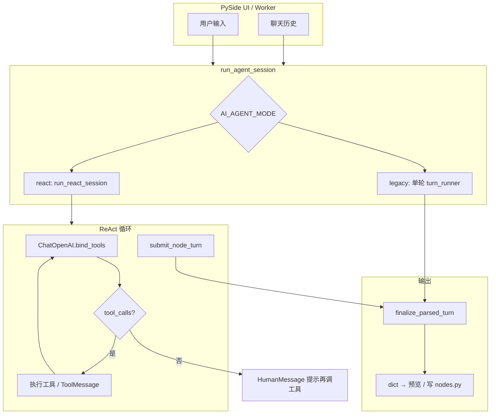

# Ryven 节点生成器 AI Agent 架构详解

> **文档用途**：向后续 AI（或论文作者）完整说明本生成器中 **AI 辅助节点设计助手** 的工程架构，便于撰写毕业设计/论文中「生成器智能化模块」「Agent 设计」等章节。  
> **阅读前提**：了解 Ryven 节点由 JSON 配置 + `core_logic`（Python 片段）构成；本仓库在 `ryven_node_generator/ai_assistant/` 实现 Agent。

---

## 1. 架构总览

### 1.1 设计目标

在 **不破坏既有 UI 契约** 的前提下，将「单次大模型吐 JSON」扩展为 **多步工具闭环（ReAct）**：模型通过 **只读/改写/测试/提交** 等工具迭代，最终仍收敛到同一套结构化产物 **`AssistantTurn`**，经 `finalize_parsed_turn` 交给界面与代码生成管线。

### 1.2 逻辑分层

| 层级 | 职责 | 典型模块 |
|------|------|----------|
| **编排（Orchestration）** | 选择 legacy 单轮 vs ReAct；裁剪历史；调用循环 | `orchestration/session.py`，`orchestration/react_loop.py` |
| **契约（Schema / Contracts）** | 对外 JSON 形状、Pydantic 校验 | `schemas.py`，`contracts/` |
| **工具宿主（Tool Host）** | 项目根、节点草稿 `draft_ref`、文件 IO、桩测、校验 | `tools/host.py` |
| **工具绑定（LangChain Tools）** | `@tool` 描述与参数，供 `bind_tools` | `tools/langchain_tools.py` |
| **归一化（Finalize）** | `AssistantTurn` → UI dict；校验 `core_logic` | `core/finalize_turn.py` |
| **合并（Merge）** | 白名单字段 patch、与基线 diff | `merge.py` |
| **上下文预算** | 条数、单条长度、节点 JSON 紧凑序列化 | `context_budget.py`，`config.py` |
| **可观测性** | 可选 JSONL 会话日志 | `session_file_log.py` |

### 1.3 数据流（概念）

---

## 2. 双模式：ReAct（默认）与 Legacy

| 环境变量 | 值 | 行为 |
|----------|-----|------|
| `AI_AGENT_MODE` | `react`（默认） | 多步 `model.invoke`；工具结果以 `ToolMessage` 回填；正常结束须 **`submit_node_turn`** 且通过 `AssistantTurn` 校验 |
| `AI_AGENT_MODE` | `legacy` / `single` / `single_turn` | **无工具循环**：单次调用 `run_turn_respecting_stream_flag`；流式正文 + `<<<JSON>>>` 或结构化解析 |

**不变量**：无论哪种模式，面向 UI 的「一轮用户请求」最终都经 **`finalize_parsed_turn`** 得到统一 dict（含 `message`、`core_logic`、`config_patch`、`self_test_cases`、`validation_error` 等）。

---

## 3. ReAct 架构详解

### 3.1 与经典 ReAct 的对应关系

- **Reason + Act**：由同一对话中的 **assistant `tool_calls`** 表达；不单独要求自然语言「Thought:」段落（由模型内部推理）。
- **观察（Observation）**：每个工具返回的字符串写入 **`ToolMessage`**，与 OpenAI 兼容的 `tool_call_id` 对齐。
- **终止**：成功路径为调用 **`submit_node_turn`**，由编排器解析为 `AssistantTurn`，再 `finalize`，**不再**向模型请求下一步（该轮 ReAct 结束）。

### 3.2 主循环语义（`run_react_session`）

1. 构造 `messages`：  
   - `SystemMessage`：长系统提示 `SYSTEM_PROMPT` + `REACT_TOOL_INSTRUCTIONS`（`prompts.py`）。  
   - `SystemMessage`：当前节点 JSON（`build_node_context_json`）+ 项目根说明。  
   - 历史：按条展开的 `HumanMessage` / `AIMessage`（纯文本，**不含** ReAct 中的 tool 轨迹）。  
   - 当前用户句：`HumanMessage(user_text)`。
2. `model = build_chat_model().bind_tools(tools)`，每步 **`invoke(messages)`**（非流式主循环；最终回复文本可通过 `on_reply_delta` 模拟流式推给 UI）。
3. **判据**：以 **`getattr(ai, "tool_calls", None)` 非空** 作为「需要执行工具」——对齐 Claude Code 思路：**以消息内容是否含工具请求为准**，而非盲信某一 `stop_reason` 字段。
4. 若 **无 `tool_calls`**：将 assistant 消息追加后，再追加一条 **`HumanMessage(nudge)`**，提示必须走工具完成；**特殊地**，若上一步工具包含 `validate_core_logic_tool` 或 `run_stub_test`，使用 **更强的收尾提示**（禁止仅发长文而不 `submit`）。
5. 若有 `tool_calls`**并行**处理多个工具调用（同一轮 assistant 可含多个 `tool_call`）：  
   - **`submit_node_turn`**：本地 Pydantic 校验；失败则 `ToolMessage` 写回错误，成功则记录 `submit_turn` 并在本轮工具循环结束后 **finalize 并 return**。  
   - **`run_shell`**：若开启 bash，须 **UI 审批**（`shell_approval_controller`）后再执行。  
   - **`compress_conversation_context`**：由编排器 **直接改写 `messages` 列表**（压缩当前用户句之前的旧多轮），**不**调用 host 占位实现。  
   - 其余工具：`tool_map[name].invoke(args)`，结果截断后写入 `ToolMessage`。
6. **步数上限**：`AI_AGENT_MAX_STEPS`（默认 24，上限 64）；超限返回带 `validation_error: react_max_steps` 的 dict。
7. **用户中断**：`should_stop` 为真时抛 `GenerationStopped` 或记录 `session_end`。

### 3.3 唯一对外交付：`submit_node_turn`

- 工具参数与 **`AssistantTurn`** 字段对齐：`message`（必填）、`core_logic`、`config_patch`、`self_test_cases`（可选）。
- 提交后 **`_finalize_submit_turn`**：将草稿节点与 `submit` 参数合并，用 **`whitelisted_config_diff(baseline_node, effective)`** 生成发给 UI 的 **增量 `config_patch`**（`core_logic` 在 finalize 中单独处理，见 `merge.py` 注释）。
- 若模型省略 `core_logic` 但草稿已有，**从草稿合并**（`_merge_core_logic_from_draft`）。

### 3.4 提示词中的 ReAct 协议要点（`REACT_TOOL_INSTRUCTIONS`）

- 按场景选择工具路径（纯聊天、只跑 shell、只改元数据、改端口+逻辑等），**反对**无意义地遍历来读文件/校验/桩测。
- **收尾规则**：在 `validate` / `run_stub_test` 之后，**下一步必须** `submit_node_turn`，不要把用户说明只写在无工具的 assistant 文本里。
- **`submit` 类型约束**：可选字段用 **省略或 JSON `null`**，**禁止**用空字符串 `""` 表示「无」——否则 Pydantic 校验失败进入 **reject 循环**（与 Claude Code「严格 inputSchema」一致的问题域）。

---

## 4. 上下文处理（Context Engineering）

### 4.1 进入模型的消息结构

1. **双 System**：通用 Ryven 规则 + 当前节点快照（含 `existing_class_names`），保证端口下标与类名唯一性提示一致。
2. **历史**：仅 **user/assistant** 字符串轮次；UI 中的 `system` 行在 `trim_history_pairs` 中丢弃。
3. **当前用户句**：单独一条 `HumanMessage`，与历史分离，便于 ReAct 在多步中仍保持「本轮任务」锚点。

### 4.2 条数预算

- **`AI_CONTEXT_MAX_MESSAGES`**：最多保留最近若干条 **user+assistant 消息**（每条 tuple 计 1）；默认 **48**；**0** 表示不限制条数（仍可能受模型窗口限制）。

### 4.3 单条长度预算

- **`AI_CONTEXT_MAX_CHARS_PER_MESSAGE`**：在条数裁剪之后，对 **每条** 历史正文截断并追加 `[truncated: …]` 标记；默认 **12000** 字符；**0** 表示不截断。  
- **用途**：抑制极长 assistant 说明（如多次算法节点长文）占满上下文。

### 4.4 节点 JSON 紧凑化

- **`AI_CONTEXT_COMPACT_JSON`**：为 true（默认）时，`build_node_context_json(..., compact=True)` 使用 **无空白** 的 `json.dumps`，降低 token。

### 4.5 工具：`compress_conversation_context`

- **动机**：在条数/长度截断仍不足时，由 **模型主动** 生成「被丢弃部分的摘要」，编排器将 **当前用户消息之前** 的旧消息替换为 **一条带摘要头的 `HumanMessage` + 保留尾部若干条**。
- **参数**：`summary_of_older_turns`（必填）、`keep_last_messages`（默认 8；0 表示仅保留摘要、去掉该区域内全部旧消息）。
- **实现要点**：维护 **`current_user_msg_idx_ref`**，在压缩后更新索引，保证后续 ReAct 步仍对准「本轮用户输入」位置。

### 4.6 可选会话日志（JSONL）

- **`AI_AGENT_SESSION_LOG`**：指向文件（相对路径相对 **project_root** 或生成器根）。  
- 记录 **`session_start`、`llm_request`、`llm_response`、`tool_round_trip`、`no_tool_calls_nudge`、`session_end`** 等，用于调试与论文中的「可观测性」描述。  
- 字段长度受 **`AI_AGENT_SESSION_LOG_FIELD_CHARS`** 限制。

---

## 5. 工具调用（Tooling）

### 5.1 工具列表与职责

| 工具名 | 类型 | 作用 |
|--------|------|------|
| `get_node_snapshot` | 只读 | 返回当前 **草稿节点** 完整 JSON（截断上限内） |
| `read_project_file` | 只读 | 项目根下 UTF-8 文本读，有 **最大字符** 上限 |
| `write_project_file` | 写 | 创建/覆盖文件；禁止 `.git` 下写入 |
| `apply_node_patch` | 写 | **`patch_json` 字符串** 解析为对象后，按 **白名单键** 合并入 `draft_ref["node"]` |
| `validate_core_logic_tool` | 只读 | AST + 禁词静态检查；**空 `code` 时校验草稿 `core_logic`** |
| `run_stub_test` | 执行 | 桩环境执行用例；**空 `core_logic` 时使用草稿** |
| `compress_conversation_context` | 元操作 | 由编排器实现上下文压缩（见 §4.5） |
| `run_shell` | 执行（受限） | 默认 **关闭**；开启后需 **命令守卫 + 超时 + UI 审批** |
| `submit_node_turn` | 交付 | 参数即 `AssistantTurn`；由编排器拦截，不执行 host 业务逻辑 |

### 5.2 宿主 `ReactToolHost`

- 持有 **`project_root`**、**`draft_ref["node"]`**、**`existing_class_names`**。
- 所有文件路径经 **`safe_path.resolve_under_root`** 约束在仓库内，防止越界读取/写入。

### 5.3 工具结果截断

- 读文件、工具输出、`get_node_snapshot` 等均有 **字符上限**（见 `config.py`：`AI_AGENT_MAX_READ_CHARS`、`AI_AGENT_MAX_TOOL_OUTPUT_CHARS` 等），对齐 **「大结果需截断或落盘」** 的 Agent 工程实践（Claude Code 中 `maxResultSizeChars` / 存储思想同类）。

---

## 6. JSON 与结构化核心限制

### 6.1 `AssistantTurn`（Pydantic）

定义见 **`schemas.py`**，核心字段：

- **`message`**：对用户可见说明（与 legacy 下流式 `<<<JSON>>>` 前正文一致的语言策略）。
- **`core_logic`**：节点 `try` 内 Python 主体；可为 `null`/省略表示无代码变更（工具模式下同样）。
- **`config_patch`**：部分节点配置；**键必须在 merge 白名单内**（见下）。
- **`self_test_cases`**：可选桩测用例列表。

### 6.2 `merge.py` 白名单

允许键集合 **`_ALLOWED`** 固定为：  
`class_name`, `title`, `description`, `color`, `inputs`, `outputs`, `core_logic`,  
`has_main_widget`, `main_widget_template`, `main_widget_args`, `main_widget_pos`, `main_widget_code`。  

**不在集合内的键**在 `apply_config_patch` 时 **忽略并记录 skip**。

### 6.3 `finalize_parsed_turn` 校验

- 对非空 `core_logic` 再次执行 **`validate_core_logic`**（与工具侧校验一致思想）。
- 失败时：**仍返回 dict**，但在 `message` 末尾追加 **`(core_logic validation failed: …)`**，并在 `validation_error` 中给出原因（便于 UI 展示与论文化「安全边界」描述）。

### 6.4 `submit_node_turn` 常见类型陷阱（与 Claude Code 对齐）

| 错误写法 | 后果 |
|----------|------|
| `config_patch: ""` | 字符串非 object，**Pydantic 拒绝** |
| `self_test_cases: ""` | 同上 |
| `core_logic: ""` | 归一化会转为「无代码」；若与意图不符易歧义 |

**推荐**：无值则 **省略键** 或 **`null`**。

### 6.5 Legacy 流式协议（`<<<JSON>>>`）

- 常量 **`JSON_SEP = "<<<JSON>>>"`**：分隔符前为面向用户说明，后为 **单个 JSON 对象**（`STREAM_FORMAT_SUFFIX` / `prompts.py`）。  
- ReAct 模式 **不依赖** 该分隔符；**最终以 `submit_node_turn` 的结构化参数为准**。

---

## 7. 与 Claude Code（`claude_code/` 源码）的对照

> 本仓库在 **`docs/agent-react-and-claude-code-reference.md`** 中有 **文件级** 对照（`Tool.ts`、`tools.ts`、`messages.ts`、Bash 安全等）。本节从 **论文/架构叙述** 角度归纳 **「严格参考」** 与 **「在本生成器上的扩展与优化」**。

### 7.1 严格参考 Claude Code 思想/实现范式的部分

1. **工具闭环**：**模型 → tool_calls → 执行 → ToolMessage → 再采样**，与 Claude Code 主查询循环同构。  
2. **工具判据**：以 **消息是否携带工具调用** 为准（CC 用 `tool_use` 块；本处用 OpenAI 兼容 **`tool_calls`**），**不**依赖单一不可靠的 stop 原因字段。  
3. **工具契约**：名称、描述、参数 schema；**严格类型**（避免 `""` 冒充 `null` 导致死循环）。  
4. **上下文对象**：`ReactToolHost` + `draft_ref` 类比 **`ToolUseContext`**（会话内共享状态、项目根、可中止）。  
5. **Bash 风险**：`run_shell` **默认关闭**；开启后 **命令守卫、超时、cwd 锁项目、输出截断**；**UI 审批** 类似 CC 的「先确认再执行」。  
6. **大结果截断**：读文件/工具输出有上限，与 **maxResultSizeChars / 截断** 同类。  
7. **侧路/独立通道**（概念级）：可选 **JSONL 会话日志** 用于调试，不污染主对话展示（类比侧路查询「不污染主 transcript」的意图，但实现为本仓库 JSONL 文件）。

### 7.2 在本项目中的修改、特化或优化（非 CC 默认形态）

| 项目 | 说明 |
|------|------|
| **领域对象** | 修改目标不是「任意仓库文件」，而是 **Ryven 节点 JSON 草稿** + **白名单 merge**；交付为 **`AssistantTurn`**，而非 CC 的通用编辑会话。 |
| **工具集** | 无 MCP、无通用 Edit；**`apply_node_patch` / `get_node_snapshot` / `run_stub_test`** 等为 **领域专用工具**。 |
| **`validate` / `stub` 空参** | **空字符串表示使用草稿 `core_logic`**，减少同一轮三次重复粘贴大段代码。 |
| **`compress_conversation_context`** | CC 无同名工具；**由编排器改写 message 列表**，属于本项目的 **显式上下文压缩** 机制。 |
| **历史双裁剪** | **条数 + 单条字符** 双重预算；CC 文档强调 transcript 增长问题，本仓库用 **环境变量** 显式控制。 |
| **收尾协议** | 针对 **validate/stub 后只发长文不调 submit** 的模型行为，增加 **强 nudge + 提示词 Closing rule**。 |
| **Legacy 模式** | 保留 **单轮 `<<<JSON>>>`** 路径，便于兼容与对照实验；CC 客户端无此「双模式」产品需求。 |
| **模型接入** | **LangChain `ChatOpenAI` + bind_tools**，兼容 OpenAI/DashScope 等；与 Anthropic 原生 API 差异由适配层吸收。 |
| **`finalize` 与 UI** | **`whitelisted_config_diff`** 生成相对会话初态的 patch，适配 **生成器 UI** 的增量应用逻辑。 |

### 7.3 可写入论文的表述建议

- **「借鉴 Claude Code 的 Agent 工程范式（工具注册、消息闭环、权限与结果截断），在 Ryven 节点生成场景中实现领域化 ReAct，并以 `AssistantTurn` 为统一契约。」**  
- **「在通用工具链之上增加节点 JSON 白名单合并、桩测工具、可选会话日志与双重上下文预算，以控制长对话与可观测性。」**

---

## 8. 关键源码索引（便于 AI 定位）

| 主题 | 路径 |
|------|------|
| 入口 | `ai_assistant/orchestration/session.py` |
| ReAct 循环 | `ai_assistant/orchestration/react_loop.py` |
| 系统提示 | `ai_assistant/prompts.py` |
| 结构化模型 | `ai_assistant/schemas.py` |
| 合并与白名单 | `ai_assistant/merge.py` |
| 工具实现 | `ai_assistant/tools/host.py`，`ai_assistant/tools/langchain_tools.py` |
| 上下文预算 | `ai_assistant/context_budget.py` |
| 配置 | `ai_assistant/config.py` |
| 会话日志 | `ai_assistant/session_file_log.py` |
| 归一化输出 | `ai_assistant/core/finalize_turn.py` |
| Claude Code 对照说明 | `docs/agent-react-and-claude-code-reference.md` |
| 分阶段重构规格 | `docs/agent-refactor-roadmap-for-ai.md` |

---

## 9. 版本与维护

- 本文描述以 **默认 `AI_AGENT_MODE=react`** 为主；**legacy** 行为请以 `core/turn_runner.py` 与提示词中的 `STREAM_FORMAT_SUFFIX` 为准。  
- 若新增工具或变更 `AssistantTurn`，请 **同步更新** 本文 §5、§6 与 `schemas.py` 注释，以便后续 AI 与论文引用一致。

---

**文档结束**
